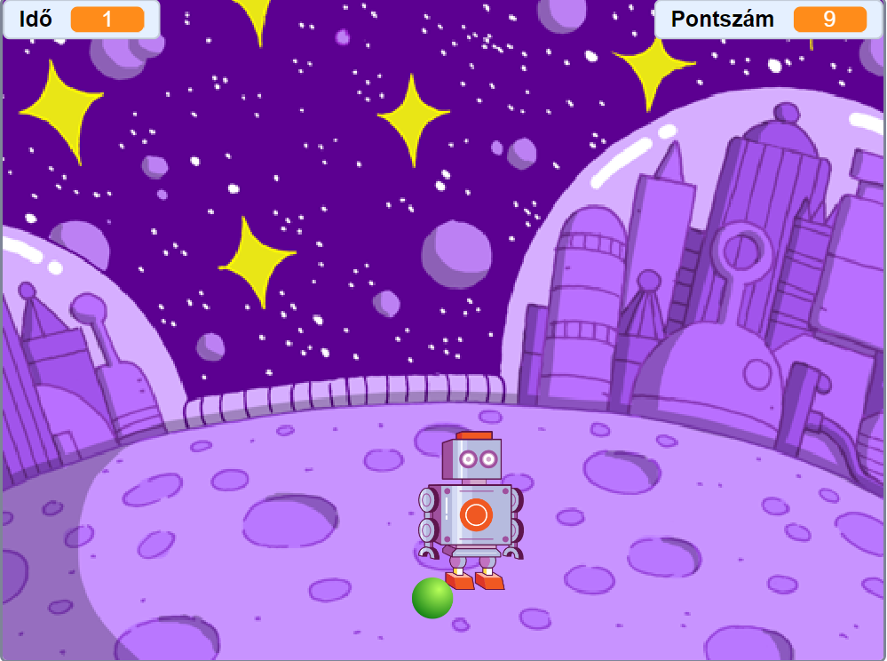

# Scratch projekt: Avoid The Bot
A projekt egy reflexjáték mejben 10 másodperc alatt 9-szer pontot kellösszegyűjteni a labda eltalálásával és a robot elkerülésével.

## Irányítás
Csak a kurzor használatára van szükség.

## Játékról

- Cél a 9 pont összegyűjtése.
- A labda sikeres eltalálása 1 pontot ér, de viszont ha a blokkolni próbáló robot kerül eltalálásra az -2 pontot jelent.

## Kép

